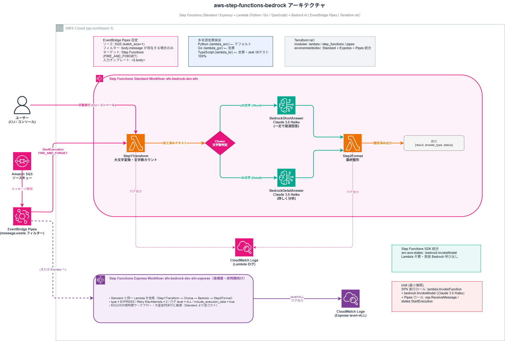
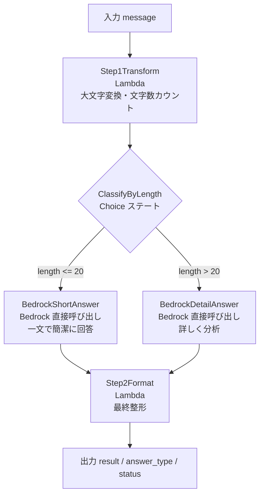

# aws-step-functions-bedrock


AWS Step Functions と Amazon Bedrock を組み合わせた AI ワークフロー自動化の実装例です。
Lambda チェーン・Bedrock 直接呼び出し・条件分岐（Choice ステート）を Terraform で IaC 化しています。

---

## アーキテクチャ

```
入力: { "message": "テキスト" }
  ↓
Step 1: テキスト加工（Lambda）
  大文字変換・文字数カウント
  ↓
条件分岐（Choice ステート）
  ├─ 20文字以下 → BedrockShortAnswer（Claude 3 Haiku 直接呼び出し: 一文で簡潔に回答）
  └─ それ以外   → BedrockDetailAnswer（Claude 3 Haiku 直接呼び出し: 詳しく分析）
  ↓（どちらも）
Step 2: 最終整形（Lambda）
  ↓
出力: { "result": "[簡潔回答 or 詳細回答] ...", "answer_type": "short|detail", "status": "success" }
```

### AWS 構成図





---

## 技術スタック

| カテゴリ | 使用技術 |
|---|---|
| ワークフロー | AWS Step Functions（Standard） |
| AI | Amazon Bedrock（Claude 3 Haiku）SDK 直接統合 |
| 条件分岐 | Step Functions Choice ステート |
| 関数実行 | AWS Lambda（Python 3.12） |
| IaC | Terraform（モジュール構成） |
| リージョン | ap-northeast-1（東京） |

---

## ワークフロー詳細

| ステート | 種別 | 役割 |
|---|---|---|
| Step1Transform | Task（Lambda） | 入力テキストを大文字変換・文字数カウント |
| ClassifyByLength | Choice | `$.length <= 20` で BedrockShortAnswer へ、それ以外は BedrockDetailAnswer へ分岐 |
| BedrockShortAnswer | Task（Bedrock SDK 統合） | Lambda を介さず Step Functions が直接 Bedrock を呼び出し・一文で回答 |
| BedrockDetailAnswer | Task（Bedrock SDK 統合） | Lambda を介さず Step Functions が直接 Bedrock を呼び出し・詳しく分析 |
| Step2Format | Task（Lambda） | Bedrock の回答を整形して最終出力を生成 |

---

## ディレクトリ構成

```
aws-step-functions-bedrock/
├── environments/
│   └── dev/
│       ├── main.tf           # メインリソース定義
│       ├── variables.tf      # 変数定義
│       ├── outputs.tf        # 出力値
│       ├── terraform.tfvars  # 変数値
│       └── definition.json   # ステートマシン定義（Choice + Bedrock 統合）
├── modules/
│   ├── lambda/               # Lambda モジュール（archive_file で自動 zip 化）
│   └── step_functions/       # Step Functions モジュール（IAM + ステートマシン）
├── lambda_src/
│   ├── sfn-step1-transform/  # テキスト加工 Lambda
│   │   └── lambda_function.py
│   └── sfn-step2-format/     # 最終整形 Lambda（Bedrock 出力対応）
│       └── lambda_function.py
└── README.md
```

---

## デプロイ手順

```bash
cd environments/dev
aws-vault exec personal-dev-source -- terraform init
aws-vault exec personal-dev-source -- terraform plan
aws-vault exec personal-dev-source -- terraform apply
```

### 動作確認（コンソール or CLI）

AWS マネジメントコンソール → Step Functions → ステートマシン → 実行開始

**短いテキスト（20文字以下）**:
```json
{ "message": "こんにちは" }
```
→ BedrockShortAnswer ルートを通り、一文の簡潔な回答が返る

**長いテキスト（21文字以上）**:
```json
{ "message": "クラウドコンピューティングの将来について教えてください" }
```
→ BedrockDetailAnswer ルートを通り、詳しい分析が返る

---

## 削除手順

```bash
aws-vault exec personal-dev-source -- terraform destroy
```

---

## スクリーンショット

### ステートマシン一覧


### ステートマシン詳細（定義 + グラフ）


### ワークフロー グラフビュー


### 実行①：短い入力（20文字以下）→ BedrockShortAnswer ルート
`{ "message": "こんにちは" }` を入力。ClassifyByLength で左ルートへ分岐し、Claude が一文で簡潔に回答。


### 実行②：長い入力（21文字以上）→ BedrockDetailAnswer ルート
`{ "message": "AWSのクラウドコンピューティングは将来どのように進化するでしょうか" }` を入力。Default ルートへ分岐し、Claude が詳しく分析して回答。


---

## IAM 設計（最小権限）

| ロール | 権限 | 対象 |
|---|---|---|
| Step Functions 実行ロール | `lambda:InvokeFunction` | sfn-step1-transform / sfn-step2-format のみ |
| Step Functions 実行ロール | `bedrock:InvokeModel` | Claude 3 Haiku（ap-northeast-1）のみ |
| Lambda 実行ロール | `AWSLambdaBasicExecutionRole` | CloudWatch Logs への書き込みのみ |

---

## 技術的な見どころ

- **Step Functions SDK 統合**: `arn:aws:states:::bedrock:invokeModel` を使い、**Lambda を介さず**直接 Bedrock を呼び出せる。コード不要でコスト・レイテンシを削減できる点が差別化ポイント
- **Choice ステートによる条件分岐**: 入力の文字数に応じてプロンプト戦略を動的に切り替え。ルールベースの分岐を宣言的に定義できる
- **オーケストレーション vs コレオグラフィ**: Step Functions は複数サービスの実行順序・エラー処理・リトライを一元管理できる（Lambda + SQS でのイベント駆動との違い）
- **Terraform モジュール化**: `archive_file` データソースで Lambda コードを自動 zip 化。モジュール分割により Lambda・Step Functions それぞれを独立して管理
- **ResultSelector**: Bedrock のレスポンス全体から必要なフィールド（`$.Body.content[0].text`）だけを取り出して次のステートに渡す

---

## コスト目安

| リソース | 概算 |
|---|---|
| Step Functions（Standard） | 月 4,000 回まで無料 |
| Lambda | 月 100 万リクエストまで無料 |
| Bedrock（Claude 3 Haiku） | 従量課金（検証レベルはほぼ $0） |

---

## AI 活用について

本プロジェクトは以下の Anthropic ツールを活用して開発しています。

| ツール | 用途 |
|---|---|
| **Claude Code** | インフラ設計・コード生成・デバッグ・コードレビュー。コミットまで一貫してサポート |
| **Claude Cowork** | 技術調査・設計相談・ドキュメント作成を日常的に活用。AI との協働を業務フローに組み込んでいる |
| **カスタム Skills** | Terraform / Python / AWS に特化した Skills を設定・継続的に更新。自分の技術スタックに最適化したワークフローを構築 |

> AI を「使う」だけでなく、自分の業務・技術スタックに合わせて**設定・運用・改善し続ける**ことを意識しています。

---

## CI / セキュリティスキャン

GitHub Actions で Terraform の静的解析（Checkov）を自動実行しています。

### 実施内容

| ジョブ | 内容 |
|---|---|
| terraform fmt | フォーマット違反の検出 |
| terraform validate | 構文・参照エラーの検出 |
| Checkov セキュリティスキャン | IaC のセキュリティポリシー違反を検出（soft_fail: false） |

### セキュリティ対応（Terraform で修正した内容）

| リソース | 追加設定 |
|---|---|
| Lambda | `tracing_config { mode = "PassThrough" }`（X-Ray 有効化）・CloudWatch Logs グループ明示 |
| Step Functions | CloudWatch Logs への実行ログ出力（ERROR レベル）・専用ロググループ |
| IAM（Bedrock ポリシー） | `Resource` を特定モデル ARN に限定（ワイルドカード使用なし） |
| CloudWatch Logs | 保持期間 30 日（変数化） |

### 意図的にスキップしている項目（dev / PoC の合理的な省略）

| チェック ID | 内容 | 理由 |
|---|---|---|
| CKV_AWS_117 | Lambda VPC 内配置 | dev/PoC では不要 |
| CKV_AWS_272 | Lambda コード署名 | dev/PoC では不要 |
| CKV_AWS_116 | Lambda DLQ 設定 | dev/PoC では不要 |
| CKV_AWS_115 | Lambda 予約済み同時実行 | dev/PoC では不要 |
| CKV_AWS_173 | Lambda 環境変数 KMS | dev/PoC では不要 |
| CKV_AWS_158 | CloudWatch Logs KMS | dev/PoC では不要 |
| CKV_AWS_338 | CloudWatch Logs 保持期間 1 年未満 | dev は 30 日で十分 |
| CKV_AWS_290 | Step Functions X-Ray トレーシング未設定 | dev/PoC では不要 |
| CKV_AWS_355 | Step Functions CMK 未設定 | dev/PoC では不要 |
| CKV_AWS_284 | Step Functions X-Ray トレーシング（別チェック） | dev/PoC では不要 |
| CKV_AWS_285 | Step Functions 実行履歴ログ | logging_configuration 設定済みだが Checkov の静的解析がモジュール内 ARN 参照を解決できないため false positive |
