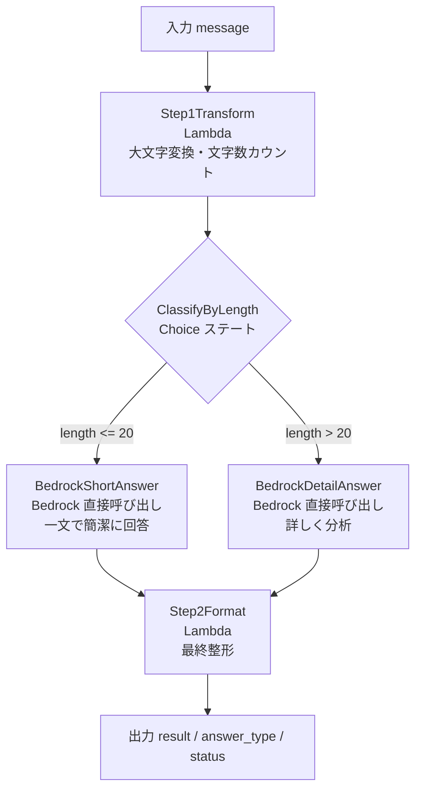
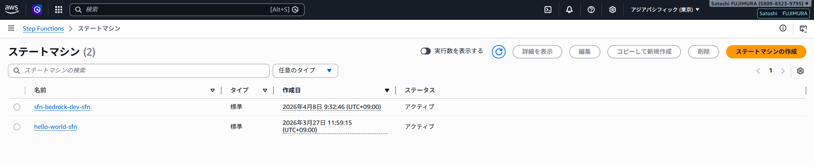
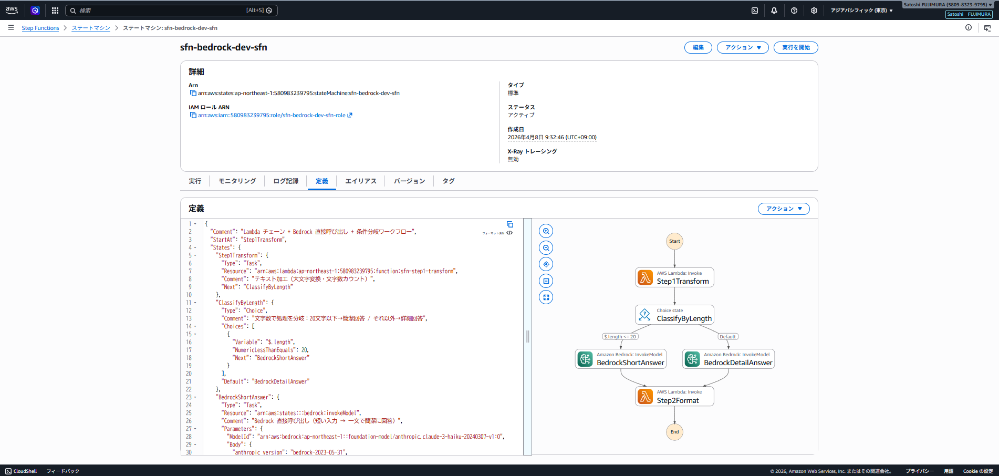
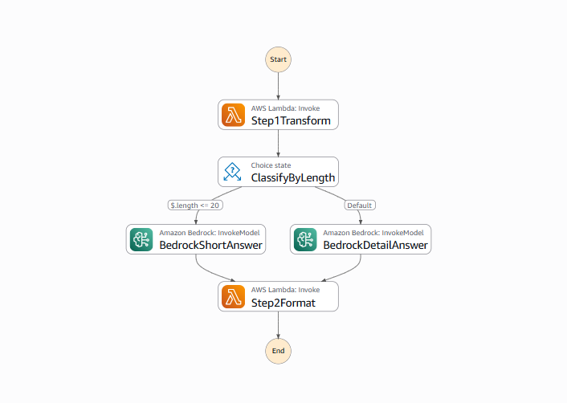
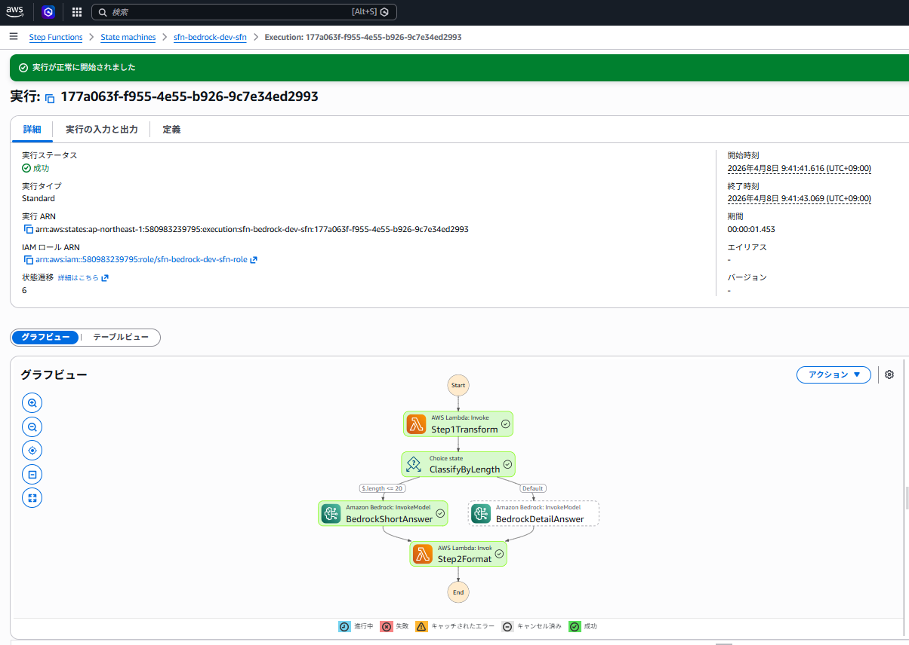
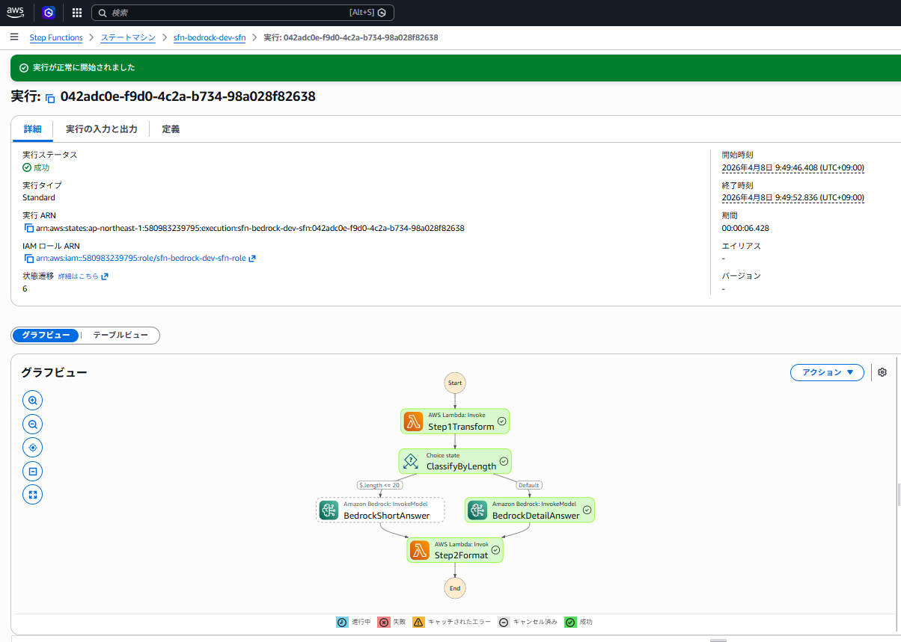
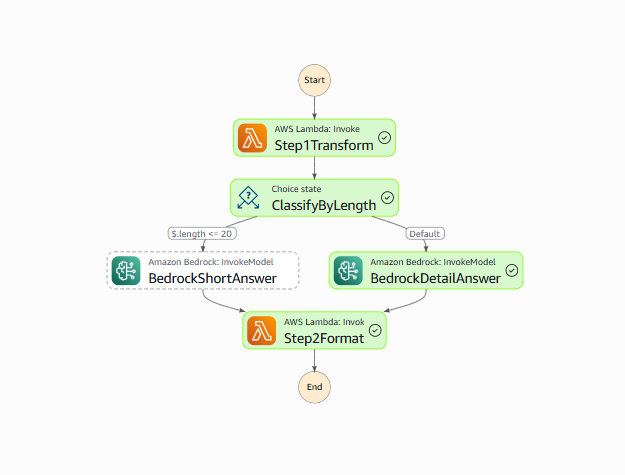

# aws-step-functions-bedrock

AWS Step Functions と Amazon Bedrock を組み合わせた AI ワークフロー自動化の実装例です。
Lambda チェーン・Bedrock 直接呼び出し・条件分岐（Choice ステート）を Terraform で IaC 化しています。

---

## アーキテクチャ

```
入力: { "message": "テキスト" }
  ↓
Step 1: テキスト加工（Lambda）
  大文字変換・文字数カウント
  ↓
条件分岐（Choice ステート）
  ├─ 20文字以下 → BedrockShortAnswer（Claude 3 Haiku 直接呼び出し: 一文で簡潔に回答）
  └─ それ以外   → BedrockDetailAnswer（Claude 3 Haiku 直接呼び出し: 詳しく分析）
  ↓（どちらも）
Step 2: 最終整形（Lambda）
  ↓
出力: { "result": "[簡潔回答 or 詳細回答] ...", "answer_type": "short|detail", "status": "success" }
```

### AWS 構成図



---

## 技術スタック

| カテゴリ | 使用技術 |
|---|---|
| ワークフロー | AWS Step Functions（Standard） |
| AI | Amazon Bedrock（Claude 3 Haiku）SDK 直接統合 |
| 条件分岐 | Step Functions Choice ステート |
| 関数実行 | AWS Lambda（Python 3.12） |
| IaC | Terraform（モジュール構成） |
| リージョン | ap-northeast-1（東京） |

---

## ワークフロー詳細

| ステート | 種別 | 役割 |
|---|---|---|
| Step1Transform | Task（Lambda） | 入力テキストを大文字変換・文字数カウント |
| ClassifyByLength | Choice | `$.length <= 20` で BedrockShortAnswer へ、それ以外は BedrockDetailAnswer へ分岐 |
| BedrockShortAnswer | Task（Bedrock SDK 統合） | Lambda を介さず Step Functions が直接 Bedrock を呼び出し・一文で回答 |
| BedrockDetailAnswer | Task（Bedrock SDK 統合） | Lambda を介さず Step Functions が直接 Bedrock を呼び出し・詳しく分析 |
| Step2Format | Task（Lambda） | Bedrock の回答を整形して最終出力を生成 |

---

## ディレクトリ構成

```
aws-step-functions-bedrock/
├── environments/
│   └── dev/
│       ├── main.tf           # メインリソース定義
│       ├── variables.tf      # 変数定義
│       ├── outputs.tf        # 出力値
│       ├── terraform.tfvars  # 変数値
│       └── definition.json   # ステートマシン定義（Choice + Bedrock 統合）
├── modules/
│   ├── lambda/               # Lambda モジュール（archive_file で自動 zip 化）
│   └── step_functions/       # Step Functions モジュール（IAM + ステートマシン）
├── lambda_src/
│   ├── sfn-step1-transform/  # テキスト加工 Lambda
│   │   └── lambda_function.py
│   └── sfn-step2-format/     # 最終整形 Lambda（Bedrock 出力対応）
│       └── lambda_function.py
└── README.md
```

---

## デプロイ手順

```bash
cd environments/dev
aws-vault exec personal-dev-source -- terraform init
aws-vault exec personal-dev-source -- terraform plan
aws-vault exec personal-dev-source -- terraform apply
```

### 動作確認（コンソール or CLI）

AWS マネジメントコンソール → Step Functions → ステートマシン → 実行開始

**短いテキスト（20文字以下）**:
```json
{ "message": "こんにちは" }
```
→ BedrockShortAnswer ルートを通り、一文の簡潔な回答が返る

**長いテキスト（21文字以上）**:
```json
{ "message": "クラウドコンピューティングの将来について教えてください" }
```
→ BedrockDetailAnswer ルートを通り、詳しい分析が返る

---

## 削除手順

```bash
aws-vault exec personal-dev-source -- terraform destroy
```

---

## スクリーンショット

### ステートマシン一覧


### ステートマシン詳細（定義 + グラフ）


### ワークフロー グラフビュー


### 実行①：短い入力（20文字以下）→ BedrockShortAnswer ルート
`{ "message": "こんにちは" }` を入力。ClassifyByLength で左ルートへ分岐し、Claude が一文で簡潔に回答。



### 実行②：長い入力（21文字以上）→ BedrockDetailAnswer ルート
`{ "message": "AWSのクラウドコンピューティングは将来どのように進化するでしょうか" }` を入力。Default ルートへ分岐し、Claude が詳しく分析して回答。





---

## IAM 設計（最小権限）

| ロール | 権限 | 対象 |
|---|---|---|
| Step Functions 実行ロール | `lambda:InvokeFunction` | sfn-step1-transform / sfn-step2-format のみ |
| Step Functions 実行ロール | `bedrock:InvokeModel` | Claude 3 Haiku（ap-northeast-1）のみ |
| Lambda 実行ロール | `AWSLambdaBasicExecutionRole` | CloudWatch Logs への書き込みのみ |

---

## 面談で説明できるポイント

- **Step Functions SDK 統合**: `arn:aws:states:::bedrock:invokeModel` を使い、**Lambda を介さず**直接 Bedrock を呼び出せる。コード不要でコスト・レイテンシを削減できる点が差別化ポイント
- **Choice ステートによる条件分岐**: 入力の文字数に応じてプロンプト戦略を動的に切り替え。ルールベースの分岐を宣言的に定義できる
- **オーケストレーション vs コレオグラフィ**: Step Functions は複数サービスの実行順序・エラー処理・リトライを一元管理できる（Lambda + SQS でのイベント駆動との違い）
- **Terraform モジュール化**: `archive_file` データソースで Lambda コードを自動 zip 化。モジュール分割により Lambda・Step Functions それぞれを独立して管理
- **ResultSelector**: Bedrock のレスポンス全体から必要なフィールド（`$.Body.content[0].text`）だけを取り出して次のステートに渡す

---

## コスト目安

| リソース | 概算 |
|---|---|
| Step Functions（Standard） | 月 4,000 回まで無料 |
| Lambda | 月 100 万リクエストまで無料 |
| Bedrock（Claude 3 Haiku） | 従量課金（検証レベルはほぼ $0） |
