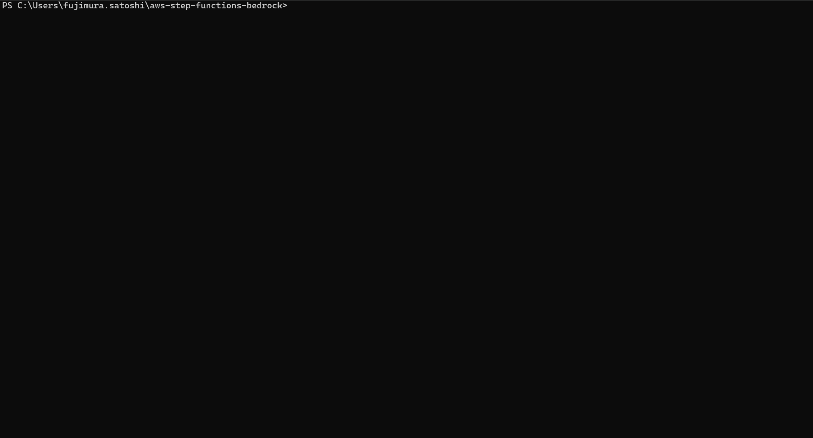
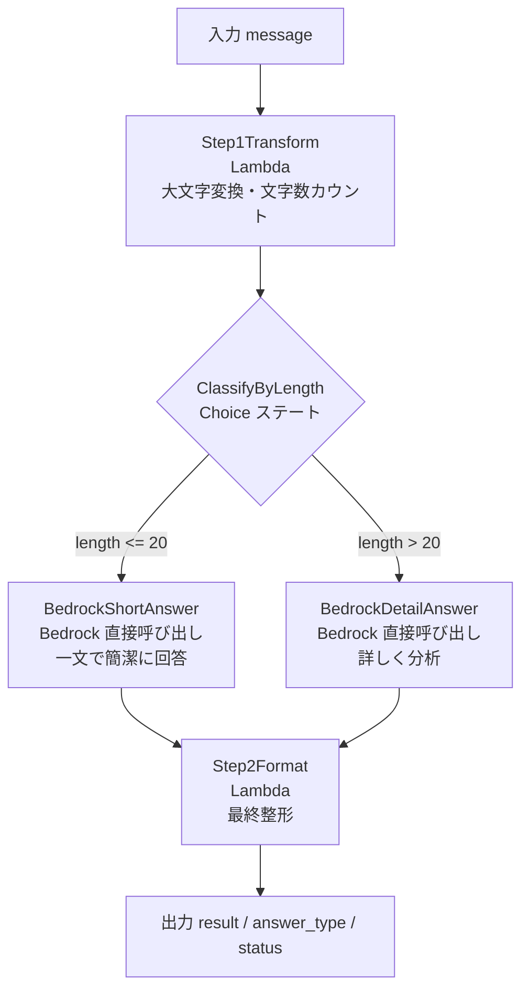

# aws-step-functions-bedrock


[](https://github.com/satoshif1977/aws-step-functions-bedrock/actions/workflows/python-test.yml)


AWS Step Functions と Amazon Bedrock を組み合わせた AI ワークフロー自動化の実装例です。
Lambda チェーン・Bedrock 直接呼び出し・条件分岐（Choice ステート）・EventBridge Pipes を Terraform で IaC 化しています。
Lambda は **Python / Go / TypeScript の 3言語**で並置実装しており、実装比較も可能です。

---

## デモ



> AWS 接続不要のローカルデモ。短いメッセージ（BedrockShortAnswer ルート）と長いメッセージ（BedrockDetailAnswer ルート）の 2 パターンを実行します。

---

## アーキテクチャ

### Standard Workflow（メイン）

```
入力: { "message": "テキスト" }
  ↓
Step 1: テキスト加工（Lambda）
  大文字変換・文字数カウント
  ↓
条件分岐（Choice ステート）
  ├─ 20文字以下 → BedrockShortAnswer（Claude Haiku 直接呼び出し: 一文で簡潔に回答）
  └─ それ以外   → BedrockDetailAnswer（Claude Haiku 直接呼び出し: 詳しく分析）
  ↓（どちらも）
Step 2: 最終整形（Lambda）
  ↓
出力: { "result": "[簡潔回答 or 詳細回答] ...", "answer_type": "short|detail", "status": "success" }
```

### Pattern C: EventBridge Pipes（SQS → Step Functions 直接起動）

```
SQS キュー（メッセージ投入）
  ↓
EventBridge Pipes
  ┌─────────────────────────────────────────┐
  │ フィルター: message フィールドが存在するもの │
  │ ターゲット: Standard Workflow を直接起動   │
  └─────────────────────────────────────────┘
  ↓
Step Functions Standard Workflow 実行
```

### Standard vs Express Workflow 比較

| 比較項目 | Standard Workflow | Express Workflow |
|---|---|---|
| 最大実行時間 | 1年 | 5分 |
| 実行履歴保持 | 90日（コンソール確認可） | CloudWatch Logs のみ |
| 価格モデル | ステート遷移回数課金 | 実行回数 + 実行時間 |
| 向いているユース | 長時間・重要なジョブ・人間承認 | 短時間・高頻度・IoT/ストリーム |
| 同期実行 | StartSyncExecution | 非対応（非同期のみ） |
| このリポジトリでの役割 | メイン実装 | 比較用並置実装 |

### AWS 構成図




---

## 技術スタック

| カテゴリ | 使用技術 |
|---|---|
| ワークフロー | AWS Step Functions（Standard + Express Workflow） |
| イベント連携 | Amazon EventBridge Pipes（SQS → Step Functions 直接起動） |
| AI | Amazon Bedrock（Claude 3.5 Haiku）SDK 直接統合 |
| 条件分岐 | Step Functions Choice ステート |
| 関数実行 | AWS Lambda（Python 3.12 / Go 1.21 / TypeScript 並置実装） |
| IaC | Terraform（モジュール構成）/ CloudFormation（比較用） |
| リージョン | ap-northeast-1（東京） |

---

## ワークフロー詳細

| ステート | 種別 | 役割 |
|---|---|---|
| Step1Transform | Task（Lambda） | 入力テキストを大文字変換・文字数カウント |
| ClassifyByLength | Choice | `$.length <= 20` で BedrockShortAnswer へ、それ以外は BedrockDetailAnswer へ分岐 |
| BedrockShortAnswer | Task（Bedrock SDK 統合） | Lambda を介さず Step Functions が直接 Bedrock を呼び出し・一文で回答 |
| BedrockDetailAnswer | Task（Bedrock SDK 統合） | Lambda を介さず Step Functions が直接 Bedrock を呼び出し・詳しく分析 |
| Step2Format | Task（Lambda） | Bedrock の回答を整形して最終出力を生成 |

---

## ディレクトリ構成

```
aws-step-functions-bedrock/
├── environments/
│   └── dev/
│       ├── main.tf                  # メインリソース定義（Standard + Express + Pipes 統合）
│       ├── variables.tf             # 変数定義
│       ├── outputs.tf               # 出力値
│       ├── terraform.tfvars         # 変数値
│       ├── definition.json          # Standard Workflow ASL（Choice + Bedrock 統合）
│       └── definition_express.json  # Express Workflow ASL（Retry MaxAttempts=2）
├── modules/
│   ├── lambda/               # Lambda モジュール（archive_file で自動 zip 化）
│   ├── step_functions/       # Step Functions モジュール（Standard + Express）
│   └── pipes/                # EventBridge Pipes モジュール（SQS → Step Functions）
├── lambda_src/               # Python 実装（デフォルト）
│   ├── sfn-step1-transform/  # テキスト加工 Lambda
│   └── sfn-step2-format/     # 最終整形 Lambda
├── lambda_go/                # Go 並置実装
│   ├── step1_transform/      # main.go + main_test.go
│   └── step2_format/         # main.go + main_test.go
├── lambda_ts/                # TypeScript 並置実装（Jest テスト・カバレッジ 100%）
│   └── src/
│       ├── step1_transform/  # index.ts + index.test.ts
│       └── step2_format/     # index.ts + index.test.ts
├── cloudformation/
│   └── template.yaml         # CloudFormation 版（Terraform との比較用）
└── README.md
```

---

## デプロイ手順

```bash
cd environments/dev
aws-vault exec personal-dev-source -- terraform init
aws-vault exec personal-dev-source -- terraform plan
aws-vault exec personal-dev-source -- terraform apply
```

### 動作確認（コンソール or CLI）

AWS マネジメントコンソール → Step Functions → ステートマシン → 実行開始

**短いテキスト（20文字以下）**:
```json
{ "message": "こんにちは" }
```
→ BedrockShortAnswer ルートを通り、一文の簡潔な回答が返る

**長いテキスト（21文字以上）**:
```json
{ "message": "クラウドコンピューティングの将来について教えてください" }
```
→ BedrockDetailAnswer ルートを通り、詳しい分析が返る

---

## 削除手順

```bash
aws-vault exec personal-dev-source -- terraform destroy
```

---

## スクリーンショット

### ステートマシン一覧


### ステートマシン詳細（定義 + グラフ）


### ワークフロー グラフビュー


### 実行①：短い入力（20文字以下）→ BedrockShortAnswer ルート
`{ "message": "こんにちは" }` を入力。ClassifyByLength で左ルートへ分岐し、Claude が一文で簡潔に回答。


### 実行②：長い入力（21文字以上）→ BedrockDetailAnswer ルート
`{ "message": "AWSのクラウドコンピューティングは将来どのように進化するでしょうか" }` を入力。Default ルートへ分岐し、Claude が詳しく分析して回答。


---

## IAM 設計（最小権限）

| ロール | 権限 | 対象 |
|---|---|---|
| Step Functions 実行ロール | `lambda:InvokeFunction` | sfn-step1-transform / sfn-step2-format のみ |
| Step Functions 実行ロール | `bedrock:InvokeModel` | Claude 3 Haiku（ap-northeast-1）のみ |
| Lambda 実行ロール | `AWSLambdaBasicExecutionRole` | CloudWatch Logs への書き込みのみ |

---

## 技術的な見どころ

- **Step Functions SDK 統合**: `arn:aws:states:::bedrock:invokeModel` を使い、**Lambda を介さず**直接 Bedrock を呼び出せる。コード不要でコスト・レイテンシを削減できる点が差別化ポイント
- **Choice ステートによる条件分岐**: 入力の文字数に応じてプロンプト戦略を動的に切り替え。ルールベースの分岐を宣言的に定義できる
- **オーケストレーション vs コレオグラフィ**: Step Functions は複数サービスの実行順序・エラー処理・リトライを一元管理できる（Lambda + SQS でのイベント駆動との違い）
- **Terraform モジュール化**: `archive_file` データソースで Lambda コードを自動 zip 化。モジュール分割により Lambda・Step Functions それぞれを独立して管理
- **ResultSelector**: Bedrock のレスポンス全体から必要なフィールド（`$.Body.content[0].text`）だけを取り出して次のステートに渡す

---

## ステートマシン定義（ASL）

`environments/dev/definition.json` に定義されたステートマシンの構造です。Terraform の `templatefile()` で Lambda ARN を動的に埋め込み、5つのステートで完全なワークフローを構成しています。

```json
{
  "Comment": "Lambda チェーン + Bedrock 直接呼び出し + 条件分岐ワークフロー",
  "StartAt": "Step1Transform",
  "States": {
    "Step1Transform": {
      "Type": "Task",
      "Resource": "<Step1TransformLambdaARN>",
      "Next": "ClassifyByLength",
      "Catch": [{ "ErrorEquals": ["States.ALL"], "Next": "HandleError", "ResultPath": "$.error" }]
    },
    "ClassifyByLength": {
      "Type": "Choice",
      "Choices": [{ "Variable": "$.length", "NumericLessThanEquals": 20, "Next": "BedrockShortAnswer" }],
      "Default": "BedrockDetailAnswer"
    },
    "BedrockShortAnswer": {
      "Type": "Task",
      "Resource": "arn:aws:states:::bedrock:invokeModel",
      "Parameters": {
        "ModelId": "arn:aws:bedrock:ap-northeast-1::foundation-model/anthropic.claude-3-5-haiku-20241022-v1:0",
        "Body": {
          "anthropic_version": "bedrock-2023-05-31",
          "max_tokens": 200,
          "messages": [{ "role": "user", "content.$": "States.Format('次のテキストに一文で簡潔に日本語で回答してください：{}', $.transformed)" }]
        }
      },
      "ResultSelector": { "bedrock_answer.$": "$.Body.content[0].text", "answer_type": "short" },
      "Next": "Step2Format",
      "Catch": [{ "ErrorEquals": ["States.ALL"], "Next": "HandleError", "ResultPath": "$.error" }]
    },
    "BedrockDetailAnswer": {
      "Type": "Task",
      "Resource": "arn:aws:states:::bedrock:invokeModel",
      "Parameters": {
        "ModelId": "arn:aws:bedrock:ap-northeast-1::foundation-model/anthropic.claude-3-5-haiku-20241022-v1:0",
        "Body": {
          "anthropic_version": "bedrock-2023-05-31",
          "max_tokens": 500,
          "messages": [{ "role": "user", "content.$": "States.Format('次のテキストについて詳しく日本語で分析・説明してください：{}', $.transformed)" }]
        }
      },
      "ResultSelector": { "bedrock_answer.$": "$.Body.content[0].text", "answer_type": "detail" },
      "Next": "Step2Format",
      "Catch": [{ "ErrorEquals": ["States.ALL"], "Next": "HandleError", "ResultPath": "$.error" }]
    },
    "Step2Format": {
      "Type": "Task",
      "Resource": "<Step2FormatLambdaARN>",
      "End": true,
      "Catch": [{ "ErrorEquals": ["States.ALL"], "Next": "HandleError", "ResultPath": "$.error" }]
    },
    "HandleError": {
      "Type": "Fail",
      "Error": "WorkflowFailed",
      "Cause": "ワークフロー実行中にエラーが発生しました。CloudWatch Logs で $.error を確認してください。"
    }
  }
}
```

> **ポイント**: `BedrockShortAnswer` / `BedrockDetailAnswer` の `Resource` が `arn:aws:states:::bedrock:invokeModel` — Lambda ARN ではなく SDK 統合の特殊 ARN を指定することで Lambda コードなしに Bedrock を直接呼び出しています。

---

## コスト目安

| リソース | 概算 |
|---|---|
| Step Functions（Standard） | 月 4,000 回まで無料 |
| Lambda | 月 100 万リクエストまで無料 |
| Bedrock（Claude 3 Haiku） | 従量課金（検証レベルはほぼ $0） |

---

## AI 活用について

本プロジェクトは以下の Anthropic ツールを活用して開発しています。

| ツール | 用途 |
|---|---|
| **Claude Code** | インフラ設計・コード生成・デバッグ・コードレビュー。コミットまで一貫してサポート |
| **Claude Cowork** | 技術調査・設計相談・ドキュメント作成を日常的に活用。AI との協働を業務フローに組み込んでいる |
| **カスタム Skills** | Terraform / Python / AWS に特化した Skills を設定・継続的に更新。自分の技術スタックに最適化したワークフローを構築 |

> AI を「使う」だけでなく、自分の業務・技術スタックに合わせて**設定・運用・改善し続ける**ことを意識しています。

---

## トラブルシューティング

| 症状 | 原因 | 対処法 |
|---|---|---|
| Step Functions 実行で `States.TaskFailed` | Bedrock への IAM 権限不足 | 実行ロールに `bedrock:InvokeModel`（特定モデル ARN）が付与されているか確認 |
| BedrockShortAnswer ステートがスキップされる | Choice ステートの条件式エラー | `definition.json` の `$.length <= 20` と Lambda 出力の `length` キーが一致しているか確認 |
| Lambda のログが CloudWatch に出ない | ロググループが未作成 | `terraform apply` で `/aws/lambda/<function-name>` が作成されているか確認 |
| `terraform destroy` で Step Functions が残る | 実行中のステートマシンがある | コンソールで実行を手動停止してから `destroy` を再実行 |

---

## ローカル開発・テスト方法

### Step Functions をコンソールから手動実行

```bash
# terraform apply 後、コンソール → Step Functions → ステートマシン → 「実行を開始」

# 短いテキスト（BedrockShortAnswer ルート）
# 入力: {"message": "こんにちは"}

# 長いテキスト（BedrockDetailAnswer ルート）
# 入力: {"message": "クラウドコンピューティングの将来について教えてください"}
```

### Lambda 関数の単体テスト

```bash
# Step1Transform Lambda を直接呼び出し
aws-vault exec personal-dev-source -- aws lambda invoke \
  --function-name sfn-step1-transform-dev \
  --payload '{"message": "hello world"}' \
  response.json
cat response.json
# 期待値: {"transformed": "HELLO WORLD", "length": 11}
```

### Python コードのローカル確認


### Go テスト

=== RUN   TestTransformUpperCase
=== RUN   TestTransformUpperCase/英小文字
=== RUN   TestTransformUpperCase/英大文字（変化なし）
=== RUN   TestTransformUpperCase/混合
=== RUN   TestTransformUpperCase/空文字
=== RUN   TestTransformUpperCase/数字・記号
--- PASS: TestTransformUpperCase (0.00s)
    --- PASS: TestTransformUpperCase/英小文字 (0.00s)
    --- PASS: TestTransformUpperCase/英大文字（変化なし） (0.00s)
    --- PASS: TestTransformUpperCase/混合 (0.00s)
    --- PASS: TestTransformUpperCase/空文字 (0.00s)
    --- PASS: TestTransformUpperCase/数字・記号 (0.00s)
=== RUN   TestTransformJapanese
--- PASS: TestTransformJapanese (0.00s)
=== RUN   TestHandlerDefaultMessage
--- PASS: TestHandlerDefaultMessage (0.00s)
=== RUN   TestResponseFields
--- PASS: TestResponseFields (0.00s)
PASS
ok  	github.com/satoshif1977/aws-step-functions-bedrock/step1_transform	0.651s
=== RUN   TestFormatResultShort
--- PASS: TestFormatResultShort (0.00s)
=== RUN   TestFormatResultDetail
--- PASS: TestFormatResultDetail (0.00s)
=== RUN   TestFormatResultUnknownType
--- PASS: TestFormatResultUnknownType (0.00s)
=== RUN   TestFormatResultEmpty
--- PASS: TestFormatResultEmpty (0.00s)
=== RUN   TestHandlerShortAnswer
--- PASS: TestHandlerShortAnswer (0.00s)
=== RUN   TestHandlerDetailAnswer
--- PASS: TestHandlerDetailAnswer (0.00s)
=== RUN   TestHandlerStatusAlwaysSuccess
--- PASS: TestHandlerStatusAlwaysSuccess (0.00s)
PASS
ok  	github.com/satoshif1977/aws-step-functions-bedrock/step2_format	0.639s

### TypeScript テスト（Jest）


up to date, audited 376 packages in 2s

62 packages are looking for funding
  run `npm fund` for details

found 0 vulnerabilities
-----------------|---------|----------|---------|---------|-------------------
File             | % Stmts | % Branch | % Funcs | % Lines | Uncovered Line #s 
-----------------|---------|----------|---------|---------|-------------------
All files        |     100 |      100 |     100 |     100 |                   
 step1_transform |     100 |      100 |     100 |     100 |                   
  index.ts       |     100 |      100 |     100 |     100 |                   
 step2_format    |     100 |      100 |     100 |     100 |                   
  index.ts       |     100 |      100 |     100 |     100 |                   
-----------------|---------|----------|---------|---------|-------------------```bash
cd lambda_src/sfn-step1-transform
python -c "
import lambda_function
result = lambda_function.lambda_handler({'message': 'hello'}, None)
print(result)
"
```

---

## CI / セキュリティスキャン

GitHub Actions で Terraform の静的解析（Checkov）を自動実行しています。

### 実施内容

| ワークフロー | ジョブ | 内容 |
|---|---|---|
|  | terraform fmt | フォーマット違反の検出 |
|  | terraform validate | 構文・参照エラーの検出 |
|  | Checkov セキュリティスキャン | IaC のセキュリティポリシー違反を検出（soft_fail: false） |
|  | go vet + go test | Go Lambda（step1/step2）の静的解析・ユニットテスト |
|  | tsc + Jest | TypeScript 型チェック・ユニットテスト（カバレッジ 100%） |

### セキュリティ対応（Terraform で修正した内容）

| リソース | 追加設定 |
|---|---|
| Lambda | `tracing_config { mode = "PassThrough" }`（X-Ray 有効化）・CloudWatch Logs グループ明示 |
| Step Functions | CloudWatch Logs への実行ログ出力（ERROR レベル）・専用ロググループ |
| IAM（Bedrock ポリシー） | `Resource` を特定モデル ARN に限定（ワイルドカード使用なし） |
| CloudWatch Logs | 保持期間 30 日（変数化） |

### 意図的にスキップしている項目（dev / PoC の合理的な省略）

| チェック ID | 内容 | 理由 |
|---|---|---|
| CKV_AWS_117 | Lambda VPC 内配置 | dev/PoC では不要 |
| CKV_AWS_272 | Lambda コード署名 | dev/PoC では不要 |
| CKV_AWS_116 | Lambda DLQ 設定 | dev/PoC では不要 |
| CKV_AWS_115 | Lambda 予約済み同時実行 | dev/PoC では不要 |
| CKV_AWS_173 | Lambda 環境変数 KMS | dev/PoC では不要 |
| CKV_AWS_158 | CloudWatch Logs KMS | dev/PoC では不要 |
| CKV_AWS_338 | CloudWatch Logs 保持期間 1 年未満 | dev は 30 日で十分 |
| CKV_AWS_290 | Step Functions X-Ray トレーシング未設定 | dev/PoC では不要 |
| CKV_AWS_355 | Step Functions CMK 未設定 | dev/PoC では不要 |
| CKV_AWS_284 | Step Functions X-Ray トレーシング（別チェック） | dev/PoC では不要 |
| CKV_AWS_285 | Step Functions 実行履歴ログ | logging_configuration 設定済みだが Checkov の静的解析がモジュール内 ARN 参照を解決できないため false positive |

## Security

See [SECURITY.md](SECURITY.md) for vulnerability reporting and security policies.
