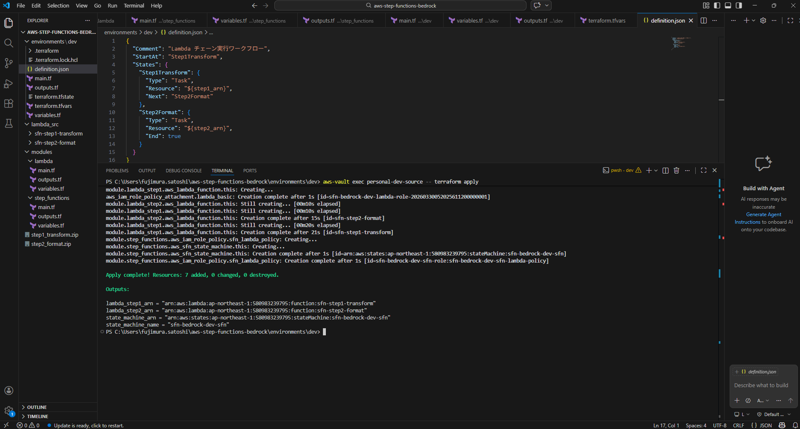
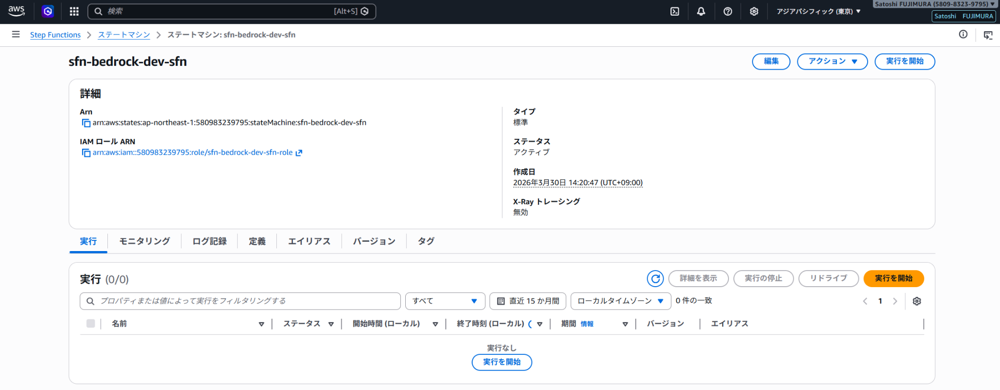
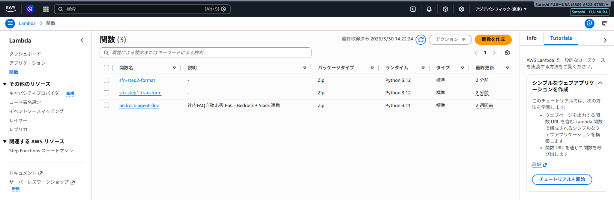
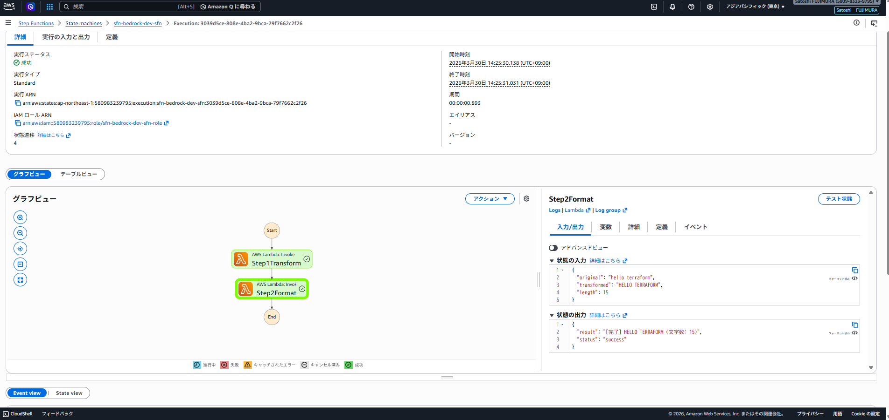

# aws-step-functions-bedrock

AWS Step Functions と Amazon Bedrock を組み合わせた AI ワークフロー自動化の実装例です。
Lambda チェーン実行・Bedrock 直接呼び出し・条件分岐を Terraform で IaC 化しています。

## アーキテクチャ

```
入力（テキスト）
  ↓
Step Functions ワークフロー
  ├─ Step 1: テキスト加工（Lambda）
  └─ Step 2: 結果を整形（Lambda）
  ↓
出力
```

## 技術スタック

| カテゴリ | 使用技術 |
|---|---|
| ワークフロー | AWS Step Functions（Standard） |
| AI | Amazon Bedrock（Claude 3 Haiku） |
| 関数実行 | AWS Lambda（Python 3.12） |
| IaC | Terraform |
| リージョン | ap-northeast-1（東京） |

## 構成

```
aws-step-functions-bedrock/
├── environments/
│   └── dev/
│       ├── main.tf           # メインリソース定義
│       ├── variables.tf      # 変数定義
│       ├── outputs.tf        # 出力値
│       ├── terraform.tfvars  # 変数値
│       └── definition.json   # ステートマシン定義
├── modules/
│   ├── lambda/               # Lambda モジュール
│   └── step_functions/       # Step Functions モジュール
├── lambda_src/
│   ├── sfn-step1-transform/  # テキスト加工 Lambda
│   │   └── lambda_function.py
│   └── sfn-step2-format/     # 結果整形 Lambda
│       └── lambda_function.py
└── README.md
```

## デプロイ手順

```bash
cd environments/dev
aws-vault exec personal-dev-source -- terraform init
aws-vault exec personal-dev-source -- terraform plan
aws-vault exec personal-dev-source -- terraform apply
```

## 削除手順

```bash
aws-vault exec personal-dev-source -- terraform destroy
```

## スクリーンショット

### terraform apply 完了


### Step Functions ステートマシン一覧


### sfn-bedrock-dev-sfn 詳細


### Lambda 関数一覧


### 実行結果（グラフビュー）


## 面談で説明できるポイント

- **Step Functions の役割**: 複数の Lambda をオーケストレーションし、ワークフローを可視化・管理
- **Lambda レス**: Bedrock の組み込みアクションを使うことで Lambda を書かずに AI を呼び出し可能
- **条件分岐**: Choice ステートで質問タイプを判定し、処理を動的に切り替え
- **IaC**: Terraform モジュール化により再利用性・保守性を向上

## コスト目安

| リソース | 概算 |
|---|---|
| Step Functions（Standard） | 月 4,000 回まで無料 |
| Lambda | 月 100 万リクエストまで無料 |
| Bedrock（Claude 3 Haiku） | 従量課金（検証レベルはほぼ $0） |
